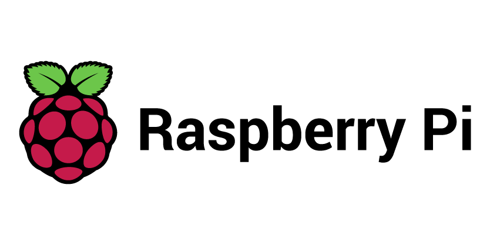
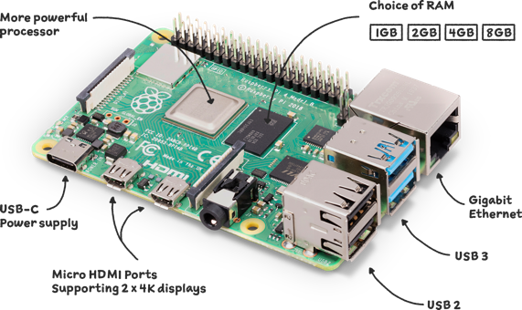
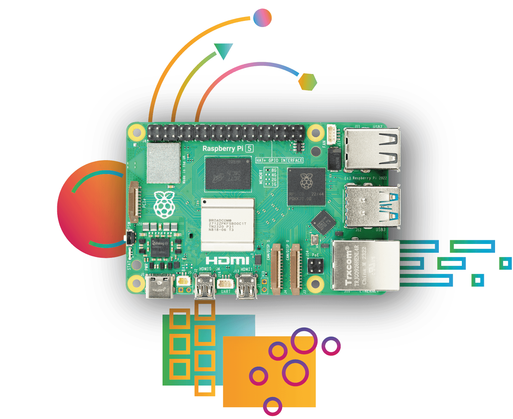
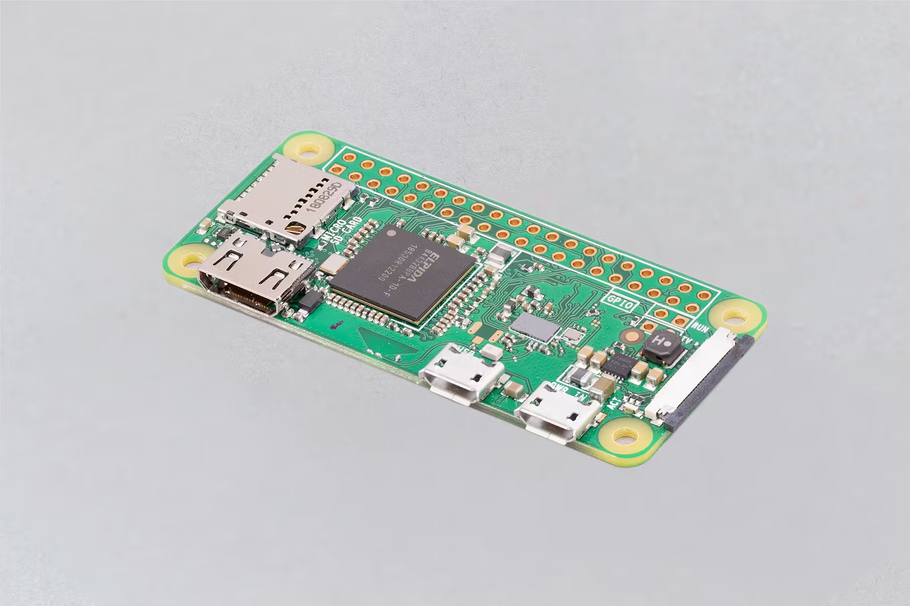
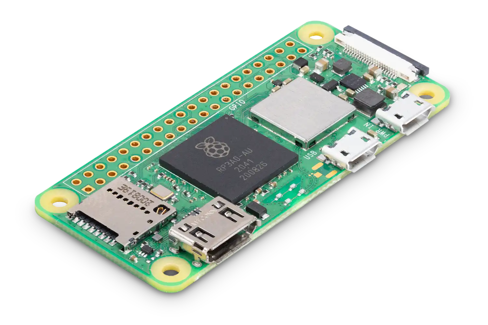

<!-- _header: "" -->
# Introduction to Raspberry Pi :pie:

By: Hedron Hackerspace

---

# What is a Single Board Computer (SBC)?

**Technical definition:**
*A computer that is entirely contained on one single PCB*

**Common characteristics:**

* ARM or RISC-V SoC (can contain x86)
* Broken out GPIO header pins (26-pin or 40-pin is standard)
* Runs some distribution of Linux (ie. Debian, Ubuntu, etc.)

---

# What are SBC's typically used for?

**Short answer:** Pretty much anything

* Home computing
* Software development
* Retro gaming
* Server host
* Home/Network Security

* Homelabs/NAS
* Robotics
* Edge AI/ML
* 3D printer manager
* Home automation

***And much, much more...***

---

# Why the Raspberry Pi?

* Community and support
* Documentation
* Open source
* Efficient* (<10W when stress tested)
* Cheap hardware**

<!-- _footer: "* - Relative to x86 machines; ** - Relative to SBCs" -->
---

# Who is the Raspberry Pi Foundation?

* UK based company, only 1 official Pi store in the Netherlands
* Named 'Raspberry Pi' in congruence with other fruit based companies
* "Computing for everyone" motto
* Specialize in low cost, educational computers
* Became *the* company for Linux/ARM SBCs
* Produce SBCs, MCUs, software, and accessories (and magazine)
* Latest product is the Raspberry Pi 5* (2-3x performance)

<!-- _footer: "* - Relative to Pi 4 in certain applications" -->
---

# Raspberry Pi 4 Model B Specs

* CPU: BCM2711
  * 4x Cortex-A72 cores @ 1.5GHz
* GPU: VideoCore VI
  * 500MHz base, 700MHz OC
* RAM: 1GB, 2GB, 4GB, 8GB
* 40-pin GPIO header
* 2-lane MIPI CSI/DSI ports

---

# Raspberry Pi 5 Specs

* CPU: BCM2712
  * 4x Cortex-A76 cores @ 2.4GHz
  * Cryptography extensions
* GPU: VideoCore VII
  * 800MHz base, 1GHz OC
* RAM: 4GB and 8GB
* A **TON** of other peripherals

---

# Raspberry Pi Zero W Specs

* CPU: BCM2835 (32-bit)
  * 1x ARM11 core @ 1GHz
* GPU: VideoCore IV
  * 250MHz base <!-- , 400MHz OC -->
* RAM: 512MB
* 40-pin GPIO header
* WiFi 2.4/5GHz, BT 4.1/BLE
* MIPI CSI camera connector

---

# Raspberry Pi Zero 2W Specs

* CPU: RP3A0-AU
  * 4x Cortex-A53 cores @ 1GHz
* GPU: VideoCore IV
* RAM: 512MB (unfortunately)
* WiFi 2.4GHz, BT 4.2/BLE
* MIPI CSI camera connector

---

# Why is the Pi Pico not listed?

* Pico is a microcontroller development board
  * Fundamentally different
  * Does not run Linux (or any kind operating system*)
  * Runs single Python or C++ programs
* Learn more in the upcoming Arduino/Microcontroller workshops
  * Hosted by yours truly

<!-- _footer: "* - Unless you use an RTOS, which is still different than a normal OS" -->
---

# Some Other SBC Brands and Vendors

#### <u>SBC Brands:</u>

* Orange/Mango/Banana Pi
* BeagleBone
* Nvidia
* Asus
* Khadas
* FriendlyElec
* Milk-V (Risc-V)
* Luck Fox (Risc-V)

#### <u>Vendors:</u>

* Adafruit
* SparkFun
* PiShop.us
* PiHut
* Pimironi
* Chicago Elecronics
* CanaKit
* Vilros

---

# What is Linux :penguin:?

* Free and open source OS developed by the Linux Foundation
* Supports many different ISAs (instruction set architectures)
  * x86
  * ARM
  * RISC-V
* Very different from Windows
  * Terminal is somewhat a necessity
  * Less application compatibility (if not using translation)
  * Significantly less bloat/background activity (ex. memory use)

---

# Time to setup the Pi

**You will need:**

1. Your Pi of choice (>3B or Zero W)
2. MicroSD card and adapter (recommended <u>></u>32GB)
3. Power adapter for your Pi (5-25W)
4. Computer or laptop with Pi Imager installed

* GUI setup: Monitor, keyboard, and mouse
* Headless setup: Ethernet, USB, or serial adapter cable to computer
<!-- _footer: "Continue to next section: **1_Basic_Setup**" -->
