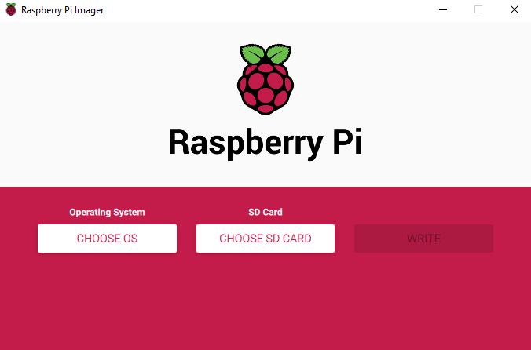
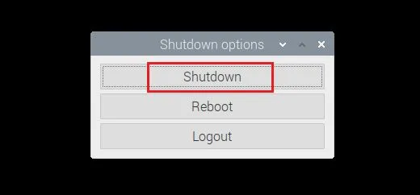

<!-- _header: "" -->
# Initial Setup with the Raspberry Pi :computer:

* Set up the hardware
* Configure the OS
* Flash and first boot
* Update and shutdown

By: Hedron Hackerspace

---

# Hardware Requirements (Pi 4B/5)

* Computer or laptop with Pi Imager installed
* 15-25W USB-C power adapter
* <u>></u>32GB MicroSD card and adapter
* GUI setup (recommended):
  * MicroHDMI to HDMI adapter and HDMI cable (for monitor)
    * Or MicroHDMI to HDMI cable
  * USB keyboard and mouse
* Headless setup:
  * Ethernet cable

---

# Hardware Requirements (Pi Zero)

* Computer or laptop with Pi Imager installed
* <u>></u>32GB MicroSD card and adapter
* GUI setup:
  * Micro USB cable to power supply
  * Mini HDMI to HDMI adapter and HDMI cable (for monitor)
    * Or a Mini HDMI to HDMI cable
  * Micro USB hub (for keyboard/mouse)
* Headless setup (recommended):
  * Micro USB data cable to computer

---

# Setting up the OS

* Choose the OS
  * Raspberry Pi OS (64-bit)
  * Use Lite version if setting up headless
* Choose Storage Device
  * Insert and select your MicroSD card
* OS Config Menu
  * Set certain user and system settings on boot
* Write
  * Flash the OS and config onto the MicroSD card

---

## OS Config Menu

* Hostname - Name of the computer
* Enable SSH - Enable if setting up headless
* Set username and password - Defaults to `pi` for both fields
* Configure wireless LAN - Connect to WiFi with given credentials
* Set Locale Settings - Set to `America/Los_Angeles`

Most of this stuff you can leave as default if on your home network. Once everything is set, flash your card*, insert it into the Pi, and give it power!
<!-- _footer: "* - There is one additional step for Zero boards using Ethernet via USB" -->
---

### For Pi Zero users

* Once the OS is flashed, reinsert the card into your computer
* Navigate to the `config.txt` file
* Scroll to the bottom and add `dtoverlay=dwc2`
* Then open the `cmdline.txt` file
* In between the words `rootwait` and `quiet`,   add `modules-load=dwc2,g_ether`
* Save both files, insert the MicroSD card, and power up!
<!-- _footer: "**You may also need to enable network sharing on your computer" -->
---

## First Boot (GUI)

* Give the Pi a minute or two to boot
* Once you see a first boot screen, login with your previously input username and password
* After you've logged in, make sure you have a solid internet connection to update the Pi in later instructions
* You can check on the top right of the taskbar
* Click the up-down arrow icon if you didn't set up wireless before and select your network

---

## First Boot (Headless)

* Make sure your Pi has a local wired or wireless connection to your computer
* Ping the Pi by opening a terminal on your computer and using `ping <pi hostname>` with your configured credentials
  * If nothing comes back, give it another minute or two to boot up
  * Try adding `.local` to the end of the hostname
* Once the ping comes back, enter `ssh <username>@<hostname>`
* Type in your password (it won't be visible when you type it)
* And you should now be logged in!

---

## Headless Troubleshooting

* If nothing comes back from the ping:
  * Make sure you are entering the right user and host names
  * Make sure it has the right network credentials
  * Make sure nothing else on the network is using the same hostname as the Pi (can conflict with other connections)
  * If wired, make sure the ethernet cable is good
    * Or if using a Pi Zero, that its a data cable, not 'charge only'
  * Give it more time to fully boot, or reboot if waited >5-10 mins
* If none of these work, send a message in our `#electronics` channel

---

# Updating the Pi

* Make sure you're connected to the internet before updating
  * Check with `ping google.com` (should return something)
* Open a terminal and input these commands   one at a time (enter `y` when prompted)
  * `sudo apt-get update` - Update `apt` repositories
  * `sudo apt-get upgrade` - Upgrade available packages
  * `sudo apt-get autoremove` - Uninstall any unused packages
  * `sudo reboot` - Reboots the computer (optional, but suggested)
* Log back in again and your Pi is now updated!

---

# Shutting Down the Pi

* GUI:
  * Click on the top left 'Start Menu'
  * Click on ':running_man:Shutdown...'
  * Click 'Shutdown'
* Headless:
  * Type `sudo shutdown now` and hit enter

---

# Next steps

* Learn some Linux
  * File system, some applications, and more
* Learn to use the terminal
  * Navigation, creating and deleting files and folders,   and system monitoring
* Foundational to using and troubleshooting the Raspberry Pi
* And more!!
<!-- _footer: "Continue to next section: **Basic_Setup_Part_2_Slides**" -->
