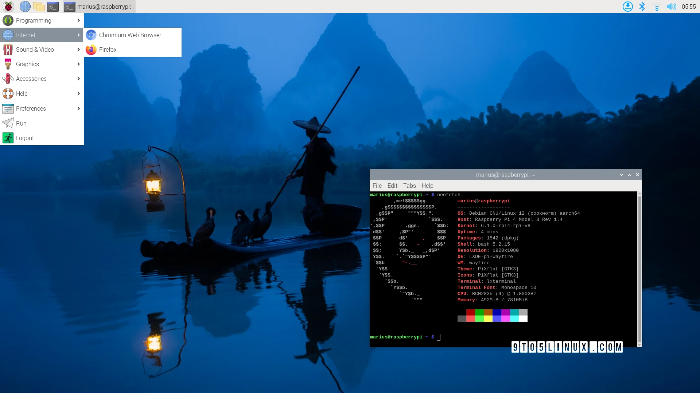
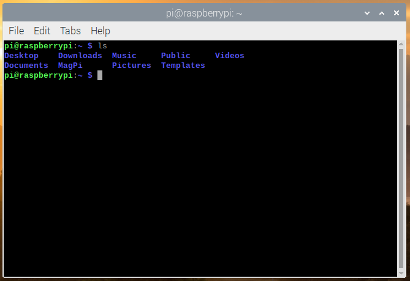
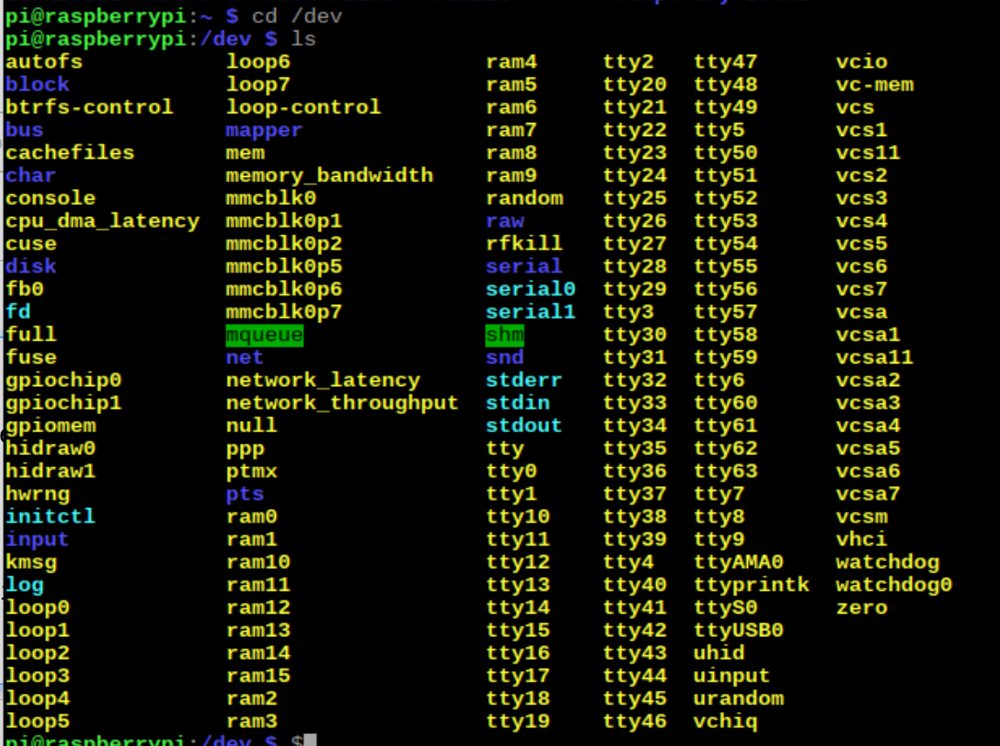

<!-- _header: "" -->
# Linux and Terminal Overview :desktop_computer:

* Pi OS desktop and compatibility overview
* Hacking with the terminal
* Some Pi specific commands

By: Hedron Hackerspace

---

# Pi OS

* Debian based
* Full desktop environment
  * LibreOffice => MS Office
  * LxTask => Task Manager
* Contains some development utilities
  * IDEs and text editors
  * Interpreters/compilers
  * Lots of CLI tools

---

# Software Compatibility

* Not everything is going to run on a Pi
  * Runs Linux instead of Windows
  * Using an ARM SoC (armv8) instead of an x86 CPU
* General hardware limitations
  * 4 cores, 4 threads (no SMT* or hyperthreading)
    * Slow cores (at most 2.1GHz all core)
  * 8GB RAM (at most)
  * Might be using a small and/or slow MicroSD card
<!-- _footer: "* - Simultaneous multithreading" -->
---

## How to find Compatible Software

### Web Search

1. Search software or task + "raspberry pi" (easiest)
2. Search for a Debian ARM version (armv8)
3. Look in support threads or forums for other people's findings

### Last Resort

* If source is available, compile it yourself

---

# The Terminal

* Text-based interface
* Speaks directly to the OS
* Extremely powerful tool
* Deceptively simple

## We will cover

* Linux file system
* Navigation commands
* Some Pi specific commands

---

# Getting Help

## `--help` flag

* `<command> --help`
* Prints out the basics on how to use the flagged command
* Try running `cd --help`

## `man` command

* Use `man <command>` to receive much more detailed information
* Short for "manual" or "man pages"
* Try running `man less`

---

# The `sudo` prefix

* Short for "superuser do"
* Runs the proceeding command as the root user
* Users not added to the `sudo` group can't use it   ('pi' user has access by default)
* Used when a command needs root permissions to run
* Try running `apt-get update`, then prefixing with `sudo`

---

# In Linux, ***EVERYTHING***   is a file

* Use the command `ls /dev`
* Shows every hardware device connected to the Pi
* `ls /dev/bus/usb/001` shows what is currently plugged into the USB ports of the Pi

<!-- _footer: "We will get into using `ls` later" -->
---

# Who, What, and Where Am I?

## `pwd` command

* Prints the working directory/folder you are currently in
  * Ex. `pwd`
* Short for  "print working directory"

## `whoami` command

* Prints the currently logged in user
  * Ex. `whoami`

## `hostname` command

* Prints the computer's name
  * Ex. `hostname`

---

# Listing Files and Moving Directories

## `ls` command

* Lists folders and files in the specified directory*
  * Ex. `ls /`
* Short for "list"
* `-a` flag to list hidden   folders and files
* `-g` flag to list permissions

## `cd` command

* Changes the active/working directory*
  * Ex. `cd ~/Desktop`
* Short for "change or choose directory"
* Uses relative and absolute directories

<!-- _footer: "* - Assumes current directory if not specified" -->
---

## Relative and Absolute Paths

* There are relative and absolute directories:
  * `.`  = Relative/current folder
  * `..` = Up one level
  * `~`  = Home directory of the active user
  * `/`  = Root directory
* Makes folder navigation much quicker
* Directories can be strung together
  * Ex. `cd ../build`
  * Ex. `cd /boot` or `cd ~/Desktop`

---

# Creating Files and Folders

## `touch` command

* Creates a file* with the specified name and extension
  * Ex. `touch notes.txt`
* File extension is not strictly necessary
  * Ex. `touch Dockerfile`

## `mkdir` command

* Creates a folder* with the specified name
  * Ex. `mkdir build`
* Short for "make directory"
* `-p` flag creates parent folders if they don't exist
  * Ex. `mkdir -p parent/child`

<!-- _footer: "* - Assumes current directory if not specified" -->
---

# Deleting Files and Folders

## `rm` command

* Deletes the specified file or folder
  * Ex. `rm notes.txt`
* Short for "remove"
* `-r` flag recursively deletes everything in a directory (including the parent folder)
  * Ex. `rm -r build/`

## `rmdir` command

* Deletes the specified folder
  * Ex. `rmdir build`
* Short for "remove directory"
* `-p` flag deletes parent folders
* Will not work if folder contains any items

---

# Moving and Copying Files

## `mv` command

* Moves contents to a   new directory
  * Ex. `mv notes.txt ~/Documents`
* Short for "move"
* Also renames files
  * Ex. `mv notes.txt nos.md`
* Works with folders too

## `cp` command

* Copies a file to a   new directory
  * Ex. `cp program.o ~/Desktop`
* Short for "copy"
* `-r` flag recursively copies folder contents
  * Ex. `cp -r build/ ~/Desktop`

---

# Viewing File Contents

## `cat` command

* Prints the contents of the file
  * Ex. `cat notes.txt`

## `less` command

* Scrollable file text with interactive commands
  * Ex. `less notes.txt`

## `head`/`tail` commands

* Prints first/last 10 lines   of a file
  * Ex. `tail notes.txt`
* `-n` prints N amount of lines
  * Ex. `head -n 25 notes.txt`
  * Ex. `tail --lines=5 temp.txt`

---

# APT Commands

* APT = Advanced Packaging Tool
* Package manager for Ubuntu/Debian based systems
* Needs root permissions
* 5 main commands (`-y` accepts "Are you sure?" prompts)
  * `install` - Installs a package
  * `remove` - Uninstalls a package (`--purge` to remove user data)
  * `update` - Updates all package info if a new version is released
  * `upgrade` - Updates all packages that have a new version
  * `autoremove` - Deletes any packages that are no longer needed

---

# Other Linux Commands

* Covered the foundational commands to any Linux system
* Too many commands to go over in one session   (let alone several classes)
* Most important commands - `man <command>` and `<command> --help`
* Some others you can try out:
  * `htop` - Terminal based task manager
  * `ip a` - Network connection information
  * `df -h` - Storage information
  * `uname -a` - Hardware and OS information

---

# Some Pi Specific Commands

* `vcgencmd measure_temp` - Measures CPU temps
* `vcgencmd measure_clock` - Measures CPU clock speed
* `vcgencmd measure_voltage` - Measures CPU voltage
* `raspinfo` - Raspberry Pi info (also creates `raspinfo.txt` in dir)
* `raspi-config` - Raspberry Pi terminal configurator
* `raspi-gpio` - Raspberry Pi GPIO command interface (covered in depth in the Python module)
* `pinout` - Raspberry Pi peripheral list and GPIO pinout diagram

---

# Next Steps

* Take some time and familiarize yourself with these commands
  * Over time, they will become second nature
* Let me know if you would like another class that covers more useful terminal commands and shortcuts in depth
* After you feel ready, move on to the Python Introduction module
  * Learn basics of Python and create your own programs
  * Learn how to read documentation
  * Interface with the GPIO pins (Digital pins, PWM, I2C/SPI, etc.)

<!-- _footer: "Continue to next section: **2_Python_Intro**" -->