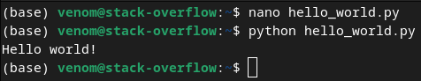

<!-- _header: "" -->

# Introduction to Python :snake:

* Variables and data types
* Basic math operations
* Control flow
* Functions
* And more...

By: Hedron Hackerspace

<!-- _footer: "Rev 1.0" -->
---

# Common Misconceptions Pt. 1

* "You need to be **smart**"
  * No you don't, just look at the instructor
* "You need to know **a lot of difficult maths**"
  * Nope, Python and libraries will do most of it for you
* "Programming is **boring**"
  * Only if you let it, there are plenty of ways to make it interesting
* "Python is **slow** compared to other languages"
  * Yes, but it depends on your implementation (ie. Numpy)

---

# Common Misconceptions Pt. 2

* "Python is for **children**"
  * A lot of data science and cybersecurity fields use   nothing *but* Python
* "Programming **isn't creative**"
  * If anything, you have to* be creative to program
* "You have to know **a lot of computer science**"
  * Really only the basics are needed
<!-- _footer: "* - At least somewhat" -->
---

# IDEs and editors

* **IDE**: *integrated development environment*
  * It's the thing you code in
  * IDEs usually have
    * Syntax highlighting
    * Integrated terminal
    * Project tree and file tabs

* **Text Editor**: *just a text editor, lol*
  * Just meant to edit text in files, but certainly usable for coding
  * Most of the time, doesn't have any quality of life features

---

# Desktop GUI: VS Code

Pi OS already has Python installed, so all we need is an **IDE**. We're going to use **VS Code**, but use whichever IDE you want.

* Open a terminal window and enter `sudo apt install code-oss`
* Type in your password and accept the "Are you sure?" prompt
* Once installation is complete, enter `code` in the terminal and VS Code should automatically open
  * Or you can go into the applications menu to open it
* Go into extensions and install the official Python extension
* Sign into GitHub if you have an account (not required)

---

# Headless: Nano

Pi OS already has Python and Nano installed, so all we need to do is open it. We're going to use **Nano**, but use whichever editor you want.

* Open a terminal window and enter `nano`
* That's it...

---

# Creating a Python File

* Open the folder you want to keep your programs in
  * VS Code: File>Open Folder
  * nano: `cd <folder>`
* Create a Python file with the name `hello_world.py`
  * VS Code: New File>"hello_world.py"
  * nano: `nano hello_world.py` or use `touch` first
  * Python files NEED the `.py` extension for the interpreter to run
* Write the line `print("Hello world!")` and save the file
  * VS Code and nano: Ctrl+S

---

# Running a Python File

* VS Code: Right click>Run Python>Run Python File in Terminal
* nano: Ctrl+X to exit (after you save)>`python hello_world.py`

Congratulations, you just created and ran your first (allegedly) Python program!

---

# 3 Key Programming Concepts

## (if you don't take anything else from this)

* Cooking == Programming
  * Conceptually the same thing, just one is significantly tastier
  * If you can cook or follow instructions, you can program
* EVERYTHING IS BINARY
  * This is a slightly more intermediate and won't be useful until a bit later
* The further you break something down, the easier it will be to implement

---

# Syntax

* "Sentence structure rules" for Python
* Rules such as:
  * Python uses whitespace and indents for scope
  * Don't start names with a number, special character, etc.
  * Don't use reserved names for variables, functions, etc.
* Would not recommend learning all the rules at once
  * Better learned slowly over time
  * We will touch on things as they become relevant

---

# Formatting

* [PEP-8](https://peps.python.org/pep-0008/) is the official Python Style Guide
  * Follow this if other people will see your code (industry standard)
* You can also develop your own style (like myself)
* If you want to follow a common casing, choose one of these:
  * **snake_case**: all lowercase, spaces are replaced with an underscore (PEP-8 uses this for *nearly everything*)
  * **camelCase**: no spaces, first letter of every word except the start is captialized (never used in Python)
  * **PascalCase**: camel case, but every word is capitalized (Objects)

---

# Formatting continued

Some languages use multiple cases. My personal style:

* snake_case: Variables
* camelCase: Functions
* PascalCase: Objects

I don't use Java... don't be getting any ideas.

---
